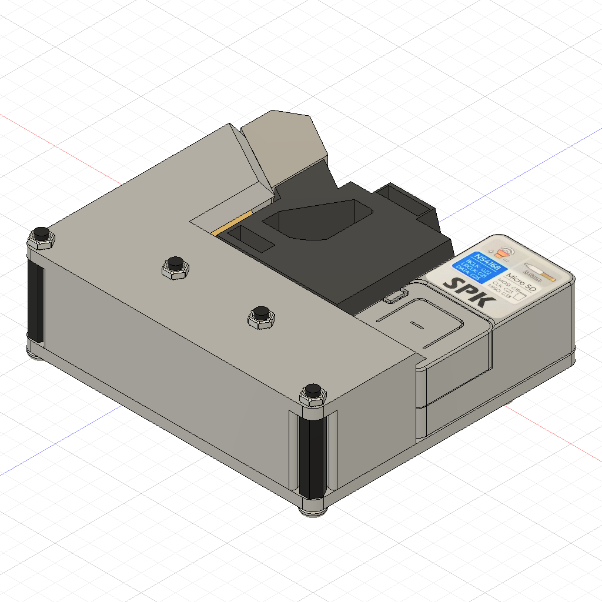
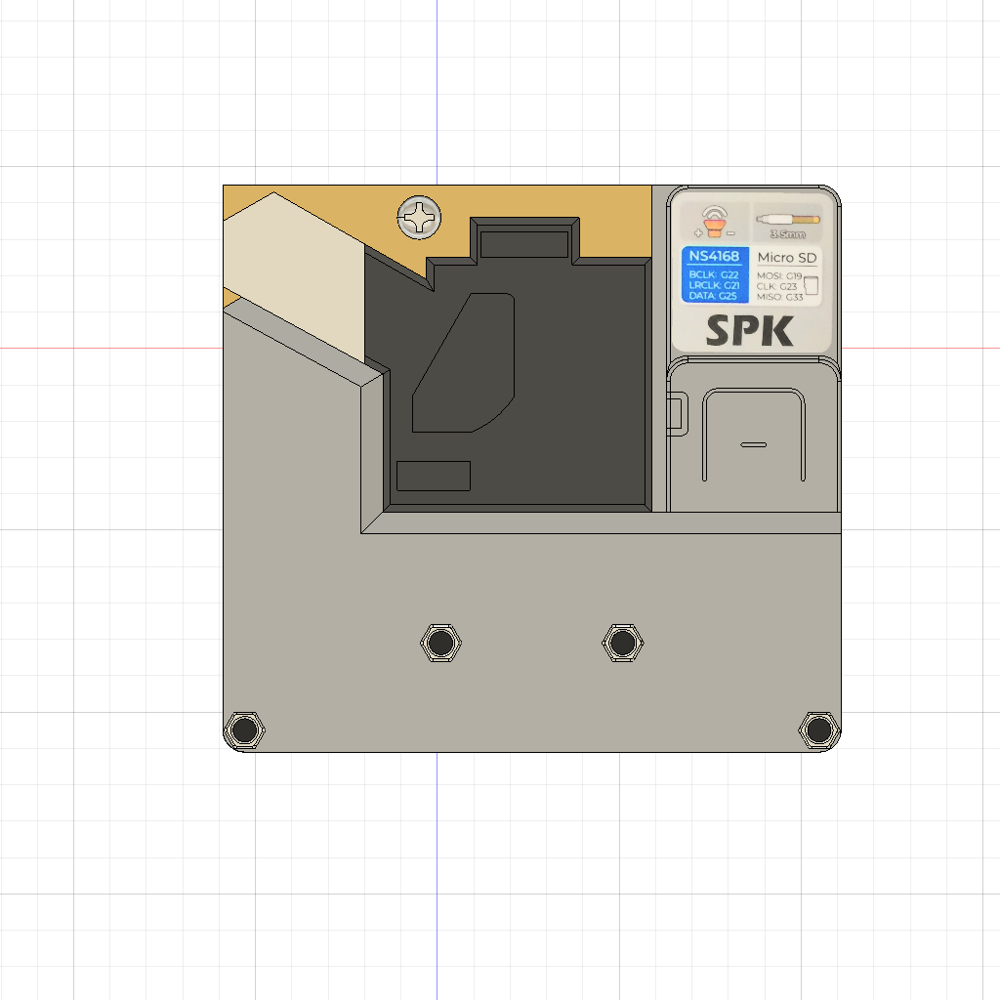

# MJCC2021 ～Microparticle Sound Generator～
本リポジトリは[M5Stack Japan Creativity Contest 2021](https://info.switch-science.com/m5stack-creativity-contest-2021)開発リポジトリです．  
ハウスダストやPM2.5をはじめとした微粒子の量をRGBLEDで可視化し，一定時間の時系列波形から音を出力します．  

# 必要なモノ
## 制御基板や電子部品
 * ATOM NS4168搭載 スピーカーキット  
   [販売ページ](https://ssci.to/7092)  
   [製品ページ](https://docs.m5stack.com/en/atom/atom_spk?id=product-features)    
 * GROVE - ダストセンサ  
   [販売ページ](https://ssci.to/3081)  
   [製品ページ](https://wiki.seeedstudio.com/jp/Grove-Dust_Sensor/)  
   [データシート](https://files.seeedstudio.com/wiki/Grove_Dust_Sensor/resource/Grove_-_Dust_sensor.pdf)  
## 筐体部品等
* 筐体部品(3Dプリント)  
  [筐体部品1](./stl/3dp_parts_1.stl)  
  [筐体部品2](./stl/3dp_parts_2.stl) 
* その他締結部品  
  M3ねじ  
  M3ナット  
  M3 20mmスペーサー
