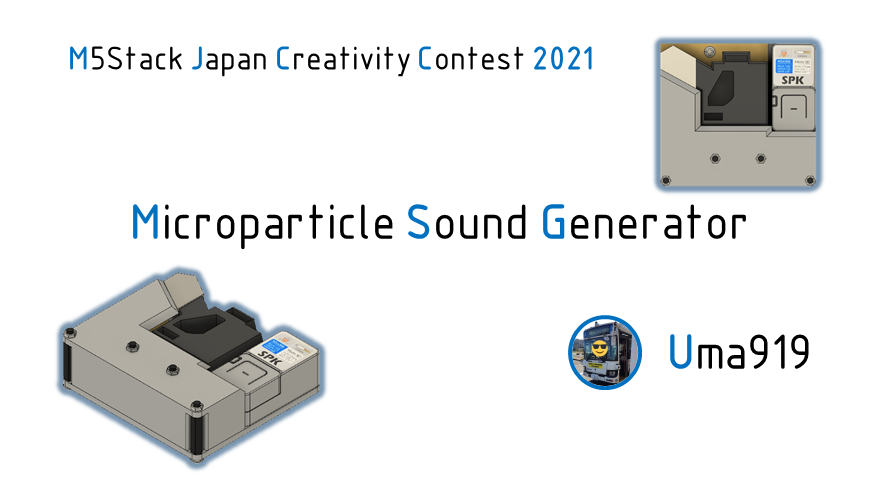
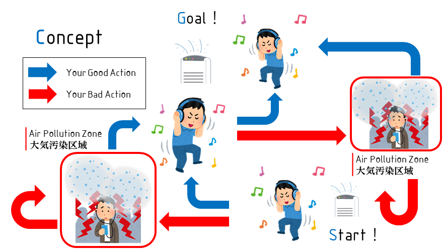
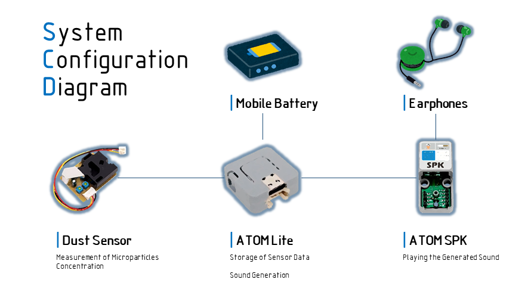

# MJCC2021
## Overview
本リポジトリは[M5Stack Japan Creativity Contest 2021](https://info.switch-science.com/m5stack-creativity-contest-2021)開発リポジトリです．  
This repository is the development repository for [M5Stack Japan Creativity Contest 2021](https://info.switch-science.com/m5stack-creativity-contest-2021).  
  

「Microparticle Sound Generator」は，ハウスダストやPM2.5をはじめとした微粒子の量をRGBLEDで可視化し，一定時間における時系列センサデータから音を生成して再生します．  
The Microparticle Sound Generator plays the generated sound with changes in the number of microparticles and also visualizes it by LED.  

## Concept
大気汚染区域では高周波音を流し，空気が澄んだ場所では心地よい？電子音を流すようにして，大気汚染区域に入らないようユーザーをナビゲートします．  
When you enter the air pollution zone, the device starts playing high-frequency sounds. On the other hand, the device will play soothing electronic sounds in the clean air area. So, the device will escort you while avoiding the air pollution zone.  

## System Configuration
1. ダストセンサにより微粒子濃度を計測する  
2. ATOM Liteにおいてセンサデータを保存し，それらに基づいて音を生成する  
3. ATOM SPKを用いて生成された音を流す  
---
1. Measure microparticle concentration with dust sensor
2. Storage sensor data in ATOM Lite and generate sound based on the data
3. Play the generated sound using ATOM SPK  

## Equipment
### 制御基板や電子部品
 * ATOM NS4168搭載 スピーカーキット  
   [販売ページ](https://ssci.to/7092)  
   [製品ページ](https://docs.m5stack.com/en/atom/atom_spk?id=product-features)    
 * GROVE - Dust Sensor  
   [販売ページ](https://ssci.to/3081)  
   [製品ページ](https://wiki.seeedstudio.com/jp/Grove-Dust_Sensor/)  
   [データシート](https://files.seeedstudio.com/wiki/Grove_Dust_Sensor/resource/Grove_-_Dust_sensor.pdf)  
### 筐体部品等
* 筐体部品(3Dプリント)  
  [筐体部品1](./stl/3dp_parts_1.stl)  
  [筐体部品2](./stl/3dp_parts_2.stl) 
* その他締結部品  
  M3ねじ  
  M3ナット  
  M3 20mmスペーサー
